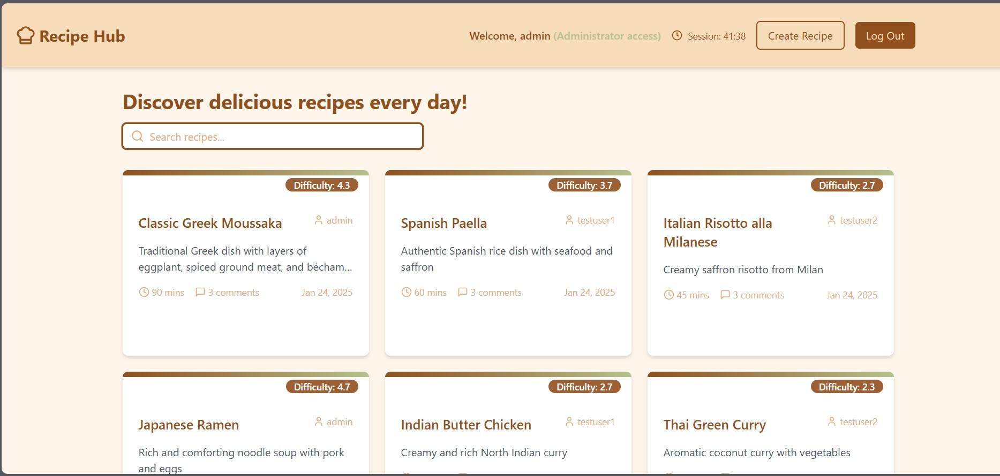

# Recipe Hub app

Recipe Hub is a full-stack web application that enables users to share, discover, comment and rate recipes. Built with Django REST Framework and React TypeScript, it features a robust backend API and an intuitive, responsive frontend interface.

This full-stack project is the final deliverable for the evaluation of trainee Nikolaos Providakis (CF6) for the Coding Factory Bootcamp of Athens University of Economics and Business (AUEB).



### Features ###

### User Experience
- Browse recipes with detailed instructions and ingredients
- Share your own recipes with the community
- Rate recipe difficulty to help other users
- Comment on recipes and engage with other users
- Responsive design works on desktop and mobile devices


### Technical Highlights
- JWT-based authentication system
- Rate limiting to prevent abuse
- Efficient database queries with pagination
- Comprehensive test coverage
- Modern, component-based frontend architecture
- Real-time form validation
- Type-safe development with TypeScript

## Project Structure

The project is organized into two main directories:

```
recipe-hub/
├── backend/          # Django REST Framework backend
│   ├── recipes/      # Main application module
│   ├── manage.py     # Django management script
│   └── requirements.txt
│
├── frontend/         # React TypeScript frontend
│   ├── src/          # Source code
│   ├── public/       # Static files
│   └── package.json
│
└── README.md         # This file
```

## Quick Start

1. Clone the repository:
   ```bash
   git clone https://github.com/nikprov/Recipe-hub-app/tree/main
   cd recipe-hub
   ```

2. Follow setup instructions in:
   - [Backend Setup](recipe_hub_backend/readme_backend.md)
   - [Frontend Setup](recipe-hub-frontend/readme-frontend.md)

3. Database Setup:
   The backend comes with a SQL script (`sample_data.sql`) that will populate your database with:
   - 12 sample recipes from world and Mediterranean cuisine
   - Test users and their interactions (comments and ratings)
   - Sample comments and ratings from each user
   
   Detailed instructions for database setup and population can be found in the backend README.

## Testing the Application

After setup, you can:
1. Access the admin interface at `/admin` (credentials in backend README)
2. Use the React frontend to browse and interact with recipes
3. Test the API directly using either the python test suite with
```bash
python manage.py test
```
(28 tests included) or with Swagger UI at `/api/docs/` 

4. Use the provided test accounts or create your own

## Contributing

Opinions/contributions are welcome! 

## License

This project is licensed under the MIT License - see the [LICENSE](LICENSE) file for details.

## Acknowledgments

- Icons by [Lucide](https://lucide.dev/)
- UI Components inspired by [shadcn/ui](https://ui.shadcn.com/)
- Built with [Django REST Framework](https://www.django-rest-framework.org/) and [React](https://reactjs.org/)
- With the assistance of LLM Claude Sonnet 3.5 - Professional Plan
