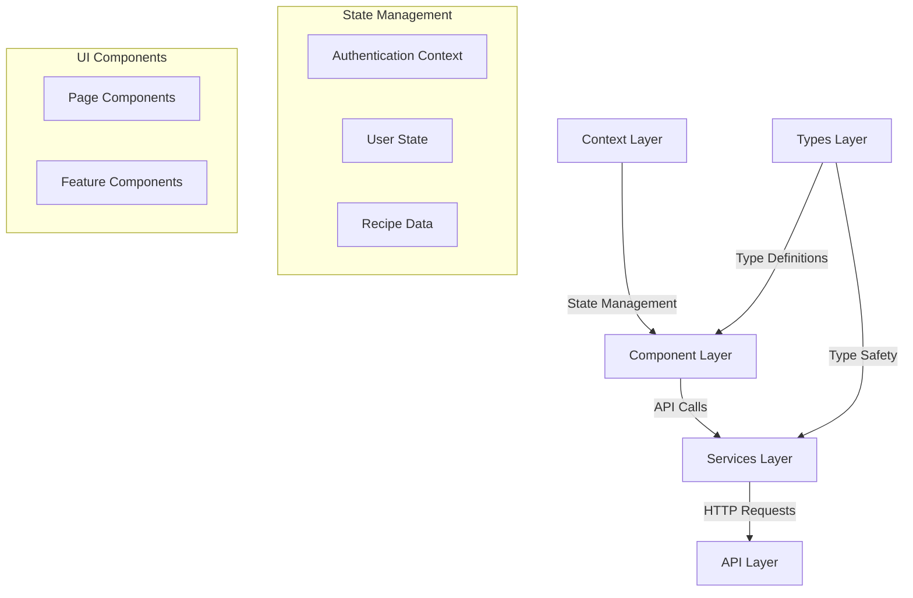

# Recipe Hub Frontend

Welcome to the Recipe Hub app frontend documentation. This React TypeScript application provides an intuitive and responsive user interface for the Recipe Hub platform. I've built it with modern web development practices, focusing on type safety, component reusability, and a great user experience. Inside the code of each component there are brief explanations of what and why do some elements exist at each respective place.

## Architecture Overview

The frontend follows a component-based architecture with clear separation of concerns:



## Key Technologies

The frontend is built using:
- React 18.3.1 with TypeScript
- Vite 6.0.5 for build tooling
- TailwindCSS for styling
- Lucide React for icons
- Framer Motion for animations
- Axios for API communication
- JWT handling for authentication

## Component Structure

The components are organized in a hierarchical structure:

```
src/

├── components/ 
│   ├── auth/           # Authentication components
│   ├── recipes/        # Recipe-related components
│   ├── comments/       # Comment-related components
│   ├── rating/         # Rating-related components
│   ├── Header/         # Header component and token-timer
│   ├── Footer/         # Footer component
│   └── icons/          # Custom icons for rating system
├── context/            # React Context providers
├── services/           # API and other services
├── types/              # TypeScript definitions
├── hooks/              # Custom React hooks
└── pages/              # common use pages
```

## Getting Started

1. Clone the repository and navigate to the frontend directory:
   ```bash
   cd recipe-hub-app/recipe-hub-frontend
   ```

2. Install dependencies:
   ```bash
   npm install
   ```

3. Start the development server:
   ```bash
   npm run dev
   ```

## Key Features and Implementation Details

### Authentication System

The authentication system uses JWT tokens with automatic refresh capabilities:

```typescript
// Example of the AuthContext implementation
const AuthContext = createContext<AuthContextType | null>(null);

export const AuthProvider: React.FC<{ children: React.ReactNode }> = ({ 
    children 
}) => {
    const [user, setUser] = useState<User | null>(null);
    const [tokenExpiry, setTokenExpiry] = useState<Date | null>(null);

    // Token refresh logic
    useEffect(() => {
        if (tokenExpiry && new Date() > tokenExpiry) {
            refreshToken();
        }
    }, [tokenExpiry]);

    // ... rest of the implementation
};
```

### Rate Limiting Handling

I implement graceful handling of API rate limits:

```typescript
// Example of rate limit error handling
const handleError = useCallback((error: unknown) => {
    if (error instanceof Error) {
        const axiosError = error as AxiosError;
        if (axiosError.response?.status === 429) {
            navigate('/throttle-error');
            return true;
        }
    }
    return false;
}, [navigate]);
```

### Form Validation

The forms include real-time validation with TypeScript type checking:

```typescript
interface RecipeFormData {
    title: string;
    description: string;
    ingredients: string;
    instructions: string;
    cooking_time: number;
}

// Form validation with type safety
const validateForm = (data: RecipeFormData): boolean => {
    // Implementation details...
};
```

## Component Examples

### Recipe Card Component

The recipe cards use motion animations for smooth interactions:

```typescript
const RecipeCard: React.FC<RecipeCardProps> = ({ recipe, delay = 0 }) => {
    const navigate = useNavigate();
    const [isHovered, setIsHovered] = useState(false);

    return (
        <motion.div
            initial={{ opacity: 0, y: 20 }}
            animate={{ opacity: 1, y: 0 }}
            transition={{ duration: 0.5, delay }}
            className="bg-white rounded-lg shadow-md"
        >
            {/* Component content */}
        </motion.div>
    );
};
```

### Difficulty Rating Component

Interactive rating component with visual feedback:

```typescript
const DifficultyIcon: React.FC<DifficultyIconProps> = ({
    rating,
    maxRating = 5,
    interactive = false,
    onRatingChange,
}) => {
    // Implementation details...
};
```

## State Management

I used React Context for state management, organized by feature:

1. Authentication State:
   - User information
   - JWT tokens
   - Login status

2. Recipe State:
   - Current recipe
   - Recipe list
   - Pagination

3. UI State:
   - Loading states
   - Error messages
   - Modal controls

## Styling Approach

I used Tailwind CSS with a custom configuration:

```typescript
// tailwind.config.js
export default {
  theme: {
    extend: {
      colors: {
        'brown': '#914F1E',
        'tan': '#DEAC80',
        'cream': '#F7DCB9',
        'sage': '#B5C18E'
      }
    }
  }
};
```

## Testing

    -To be added later... (Cypress)

## Development Guidelines

1. Component Creation:
   - Use TypeScript interfaces for props
   - Implement proper error boundaries
   - Add loading states
   - Handle edge cases

2. Styling:
   - Use Tailwind utility classes
   - Follow the design system
   - Ensure responsive design
   - Maintain accessibility

3. State Management:
   - Use appropriate React hooks
   - Implement proper type checking
   - Handle loading and error states
   - Maintain clean update logic

## Troubleshooting Common Issues

1. Build Issues:
   ```bash
   # Clear node modules and reinstall
   rm -rf node_modules
   npm install
   ```

2. Type Errors:
   ```bash
   # Regenerate TypeScript types
   npm run type-check
   ```

3. CORS Issues:
   - Check API URL
   - Verify backend CORS settings
   - Check network requests

## Contributing

To contribute to the frontend:

1. Fork the repository
2. Create a feature branch
3. Follow the style guide
4. Add tests for new features
5. Submit a pull request

## Available Scripts

This application is made for development purposes only and thus only 
the script `npm run dev` is intented to be used. The rest available below,
though they may work I cannot guarantee they will run successfully.

- `npm run dev`: Start development server 
- `npm run build`: Build for production
- `npm run preview`: Preview production build
- `npm run lint`: Run ESLint
- `npm run type-check`: Check TypeScript types

## License

See LICENSE at root dir
