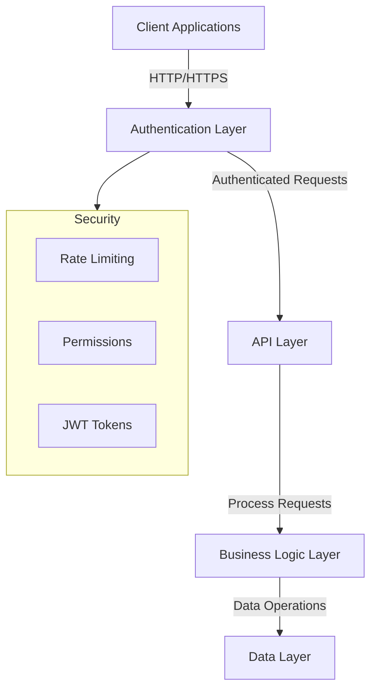

# Recipe Hub Backend

Welcome to the Recipe Hub backend documentation. This Django REST Framework application provides a robust API for managing recipes, user interactions, and authentication. The backend is designed with security, scalability, and performance in mind.

## System Architecture

The backend follows a layered architecture pattern:



## Features

### Authentication & Security
- JWT-based authentication with configurable token lifetimes
- Custom registration system with enhanced security:
  - Email uniqueness enforcement
  - Password strength requirements
  - Role-based registration control
- Rate limiting to prevent abuse:
  - Anonymous users: 60 requests/minute
  - Authenticated users: 150 requests/minute

### Recipe Management
- Complete CRUD operations for recipes
- Author-only access for modifications
- Optimized database queries using select_related and prefetch_related
- Pagination support (10 items per page)
- Comprehensive search capabilities

### Interaction Systems
- Nested comment system with full CRUD operations
- Difficulty rating system:
  - One rating per user per recipe
  - Automatic average calculation
  - Update limitations to prevent abuse
- Fine-grained permission controls

## Technical Requirements

- Python 3.8+
- MySQL 8.0+
- Virtual environment (recommended)
- Required packages listed in requirements.txt

## Installation

1. Clone the repository:
   ```bash
   git clone [your-repository-url]
   cd recipe-hub/backend
   ```

2. Create and activate a virtual environment:
   ```bash
   python -m venv venv
   source venv/bin/activate  # On Windows: venv\Scripts\activate
   ```

3. Install dependencies:
   ```bash
   pip install -r requirements.txt
   ```

4. Configure your environment:
   Create a .env file in the backend directory with these settings:
   ```ini
   # Django configuration
   SECRET_KEY='your-secret-key'
   DEBUG=True

   # Database configuration
   DB_NAME=recipe_hub_db
   DB_USER=your_db_user
   DB_PASSWORD=your_db_password
   DB_HOST=localhost
   DB_PORT=3306

   # JWT configuration
   JWT_ACCESS_TOKEN_LIFETIME=50  # minutes
   JWT_REFRESH_TOKEN_LIFETIME=1440  # minutes
   ```

5. Create the MySQL database:
   ```sql
   CREATE DATABASE recipe_hub_db CHARACTER SET utf8mb4 COLLATE utf8mb4_unicode_ci;
   ```

6. Apply migrations:
   ```bash
   python manage.py migrate
   ```

7. Create a superuser:
   ```bash
   python manage.py createsuperuser
   ```

## Sample Data Generation

You have two options for populating the database with sample data:

### Option 1: Using Fixtures
Load the basic sample data (1 recipe, 1 comment, 1 rating):
```bash
python manage.py loaddata sample_recipes
```

### Option 2: Using Generation Script
Generate a full set of sample data (12 recipes with comments and ratings):
```bash
python manage.py shell < generate_sample_data.py
```

The generation script will create:
- Admin user (username: admin, password: AdminPass123!)
- Test user (username: testuser1, password: TestPass123!)
- 12 recipes (6 from each user)
- 3 comments per recipe
- 2 ratings per recipe

## API Endpoints

### Authentication
- POST `/api/auth/registration/`: Register new user
- POST `/api/auth/token/`: Obtain JWT token
- POST `/api/auth/token/refresh/`: Refresh JWT token
- GET `/api/auth/user/`: Get user details

### Recipes
- GET `/api/recipes/`: List recipes (paginated)
- POST `/api/recipes/`: Create recipe
- GET `/api/recipes/{id}/`: Get recipe details
- PUT `/api/recipes/{id}/`: Update recipe
- DELETE `/api/recipes/{id}/`: Delete recipe

### Comments
- GET `/api/recipes/{recipe_id}/comments/`: List comments
- POST `/api/recipes/{recipe_id}/comments/`: Add comment
- PUT `/api/recipes/{recipe_id}/comments/{id}/`: Update comment
- DELETE `/api/recipes/{recipe_id}/comments/{id}/`: Delete comment

### Difficulty Ratings
- GET `/api/recipes/{recipe_id}/difficulty-ratings/`: List ratings
- POST `/api/recipes/{recipe_id}/difficulty-ratings/`: Add rating
- PUT `/api/recipes/{recipe_id}/difficulty-ratings/{id}/`: Update rating
- DELETE `/api/recipes/{recipe_id}/difficulty-ratings/{id}/`: Delete rating

## Rate Limiting

The API implements the following rate limits:
- Anonymous users: 60 requests per minute
- Authenticated users: 150 requests per minute

Rate limit headers in responses:
- X-RateLimit-Limit: Maximum requests allowed
- X-RateLimit-Remaining: Requests remaining
- X-RateLimit-Reset: Time until limit resets

## Testing

Run the comprehensive test suite:
```bash
python manage.py test
```

The test suite covers:
- Authentication flows
- CRUD operations
- Permission checks
- Rate limiting
- Data validation
- Edge cases

## Security Considerations

1. Password Security:
   - Minimum length enforcement
   - Complexity requirements
   - Hashing using Django's default PBKDF2

2. API Security:
   - JWT token expiration
   - CORS configuration
   - Rate limiting
   - Permission-based access control

3. Data Validation:
   - Input sanitization
   - Field validation
   - Relationship integrity

## Performance Optimizations

1. Database:
   - Efficient indexing
   - Optimized queries using select_related
   - Proper model relationships

2. API:
   - Pagination to handle large datasets
   - Cached authentication checks
   - Optimized serializers

## Development Guidelines

1. Code Style:
   - Follow PEP 8
   - Use meaningful variable names
   - Add docstrings to functions/classes

2. Testing:
   - Write tests for new features
   - Maintain test coverage
   - Test edge cases

3. API Design:
   - Follow REST principles
   - Use appropriate HTTP methods
   - Provide meaningful error messages

## Troubleshooting

Common issues and solutions:

1. Database Connection:
   ```bash
   # Check MySQL service
   sudo service mysql status
   
   # Verify credentials
   mysql -u your_user -p
   ```

2. Migration Issues:
   ```bash
   # Reset migrations
   python manage.py migrate --fake recipes zero
   python manage.py migrate recipes
   ```

3. Permission Issues:
   ```bash
   # Grant necessary MySQL permissions
   GRANT ALL PRIVILEGES ON recipe_hub_db.* TO 'your_user'@'localhost';
   FLUSH PRIVILEGES;
   ```

## Contributing

1. Fork the repository
2. Create your feature branch
3. Write tests for new features
4. Submit a pull request

## License

[Your chosen license]
