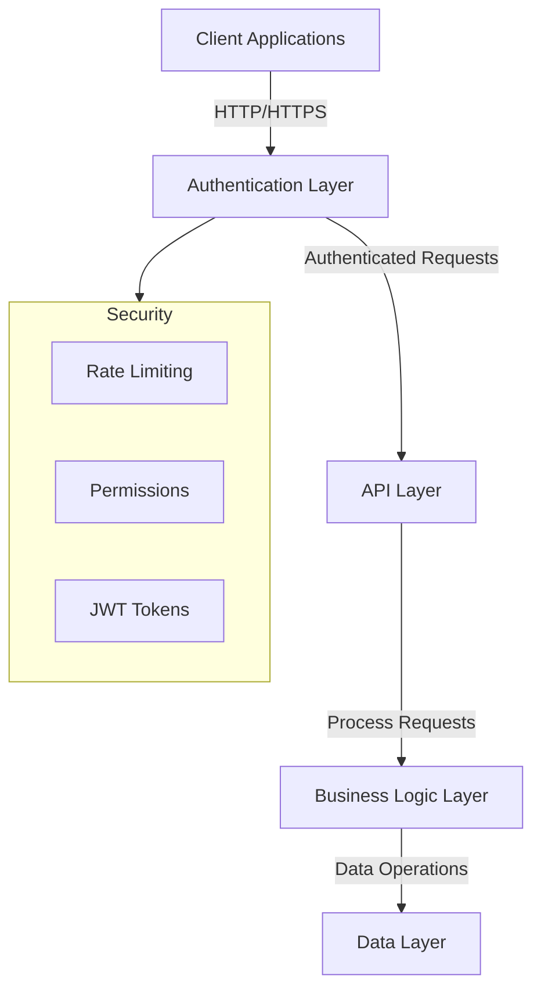

# Recipe Hub Backend

Welcome to the Recipe hub app backend documentation. This Django REST Framework application provides a robust API for managing recipes, user interactions, and authentication. The backend is designed with security, scalability, and performance in mind.

## System Architecture

The backend follows a layered architecture pattern:



## Features

### Authentication & Security
- JWT-based authentication with configurable token lifetimes
- Custom registration system with enhanced security:
  - Email uniqueness enforcement
  - Password strength requirements
  - Role-based registration control
- Rate limiting to prevent abuse:
  - Anonymous users: 60 requests/minute
  - Authenticated users: 150 requests/minute

### Recipe Management
- Complete CRUD operations for recipes
- Author-only access for modifications
- Optimized database queries using select_related and prefetch_related
- Pagination support (10 items per page)
- Comprehensive search capabilities

### Interaction Systems
- Nested comment system with full CRUD operations
- Difficulty rating system:
  - One rating per user per recipe
  - Automatic average calculation
  - Update limitations to prevent abuse
- Fine-grained permission controls

## Technical Requirements

- Python 3.8+
- MySQL 8.0+
- Virtual environment (recommended)
- Required packages listed in requirements.txt

## Installation

1. Clone the repository:
   ```bash
   git clone https://github.com/nikprov/Recipe-hub-app/tree/main
   cd recipe-hub-app/recipe_hub_backend
   ```

2. Create and activate a virtual environment:
   ```bash
   python -m venv venv
   source venv/bin/activate
     # On Windows: venv\Scripts\activate
   ```

3. Install dependencies:
   ```bash
   pip install -r requirements.txt
   ```

4. Configure your environment:
   Create a .env file in the backend directory with these settings:
   ```ini
   # Django configuration
   SECRET_KEY='your-secret-key'
   DEBUG=True

   # Database configuration
   DB_NAME=recipe_hub_db
   DB_USER=your_db_user
   DB_PASSWORD=your_db_password
   DB_HOST=localhost
   DB_PORT=3306

   # JWT configuration
   JWT_ACCESS_TOKEN_LIFETIME=50  # minutes
   JWT_REFRESH_TOKEN_LIFETIME=1440  # minutes
   ```

5. Database Setup Options

   I recommend using a mySQL database but you can use of course the SQLite that comes out-of-the-box with the Django installation. Should you decide the mySQL (or whichever else) first install it in your system and then create the
   mySQL database within the mySQL Workbench with schema name: `recipe_hub_db`, character set: `utf8mb4` collation: `utf8mb4_0900_ai_ci`.

   ### Option 1: SQLite (Simplest)
   Django's default SQLite configuration:
   ```python
   DATABASES = {
      'default': {
         'ENGINE': 'django.db.backends.sqlite3',
         'NAME': BASE_DIR / 'db.sqlite3',
      }
   }
   ```

   ### Option 2: MySQL (Current Configuration)
   Using environment variables:
   ```python
   DATABASES = {
      'default': {
         'ENGINE': 'django.db.backends.mysql',
         'NAME': os.getenv('DB_NAME'),
         'USER': os.getenv('DB_USER'),
         'PASSWORD': os.getenv('DB_PASSWORD'),
         'HOST': os.getenv('DB_HOST'),
         'PORT': os.getenv('DB_PORT'),
      }
   }
   ```


   ## Make and then apply migrations:
      ```bash
      python manage.py makemigrations
         # and then:
      python manage.py migrate
      ```


   ## Creating Admin and some Test Users

   1. Create admin superuser:
      ```bash
      python manage.py createsuperuser
      ```
      Use these credentials:
      - Username: admin
      - Email: admin@example.com
      - Password: AdminPass123! (or simpler for quick-testing purposes like 12345 but change it later)

   2. Create test users via either ways:
      - Through the admin interface at `/admin`
      - Using Django's shell:
      ```python
      python manage.py shell
      
      from django.contrib.auth.models import User
      User.objects.create_user('testuser1', 'test1@example.com', 'TestPass123!')
      User.objects.create_user('testuser2', 'test2@example.com', 'TestPass123!')
      ```


## Populating with Sample Data

1. The `sample_data.sql` script in the `scripts` directory contains:
   - 12 recipes (world and Mediterranean cuisine)
   - Comments from admin, testuser1, and testuser2 on each recipe
   - Difficulty ratings from each user on each recipe

2. To execute the script:
   
   For SQLite:
   ```bash
   sqlite3 db.sqlite3 < scripts/sample_data.sql
   ```

   For MySQL:
   ```bash
   mysql -u your_user -p recipe_hub_db < scripts/sample_data.sql
   ```


## API Endpoints

### Authentication
- POST `/api/auth/registration/`: Register new user
- POST `/api/auth/token/`: Obtain JWT token
- POST `/api/auth/token/refresh/`: Refresh JWT token
- GET `/api/auth/user/`: Get user details

### Recipes
- GET `/api/recipes/`: List recipes (paginated)
- POST `/api/recipes/`: Create recipe
- GET `/api/recipes/{id}/`: Get recipe details
- PUT `/api/recipes/{id}/`: Update recipe
- DELETE `/api/recipes/{id}/`: Delete recipe

### Comments
- GET `/api/recipes/{recipe_id}/comments/`: List comments
- POST `/api/recipes/{recipe_id}/comments/`: Add comment
- PUT `/api/recipes/{recipe_id}/comments/{id}/`: Update comment
- DELETE `/api/recipes/{recipe_id}/comments/{id}/`: Delete comment

### Difficulty Ratings
- GET `/api/recipes/{recipe_id}/difficulty-ratings/`: List ratings
- POST `/api/recipes/{recipe_id}/difficulty-ratings/`: Add rating
- PUT `/api/recipes/{recipe_id}/difficulty-ratings/{id}/`: Update rating
- DELETE `/api/recipes/{recipe_id}/difficulty-ratings/{id}/`: Delete rating

## API endpoint Permissions

### Authentication
- POST `/api/auth/registration/`: Unauthenticated users `OR` superusers
- POST `/api/auth/token/`: all users
- POST `/api/auth/token/refresh/`: all users
- GET `/api/auth/user/`: all users

### Recipes
- GET `/api/recipes/`: all users
- POST `/api/recipes/`: authenticated users
- GET `/api/recipes/{id}/`: authenticated users
- PUT `/api/recipes/{id}/`: authenticated users `&` authors of {id} recipe
- DELETE `/api/recipes/{id}/`: authenticated users `&` authors of {id} recipe `OR` superusers

### Comments
- GET `/api/recipes/{recipe_id}/comments/`: authenticated users
- POST `/api/recipes/{recipe_id}/comments/`: authenticated users
- PUT `/api/recipes/{recipe_id}/comments/{id}/`: authenticated users `&` authors of {id} recipe
- DELETE `/api/recipes/{recipe_id}/comments/{id}/`: authenticated users `&` authors of {id} recipe `OR` superusers

### Difficulty Ratings
- GET `/api/recipes/{recipe_id}/difficulty-ratings/`: authenticated users - GET method for this endpoint is used indirectly in the frontend to calculate the average value of all ratings for the respective recipe. Therefore, an unauthenticated user can only see the average difficulty rating value both in recipe list and recipe detail page.
- POST `/api/recipes/{recipe_id}/difficulty-ratings/`: authenticated users - Only one POST per user per recipe.
- PUT `/api/recipes/{recipe_id}/difficulty-ratings/{id}/`: authenticated users `&` authors of {id} difficulty-ratings This action has a frontend throttle limit of 5 times/recipe {id}. Displays a warning message.
- DELETE `/api/recipes/{recipe_id}/difficulty-ratings/{id}/`: authenticated users `&` authors of difficulty-ratings/{id}  `OR` superusers - Not accesible from the frontend yet.


## Rate Limiting

The API implements the following rate limits:
- Anonymous users: 60 requests per minute
- Authenticated users: 150 requests per minute

Rate limit headers in responses:
- X-RateLimit-Limit: Maximum requests allowed
- X-RateLimit-Remaining: Requests remaining
- X-RateLimit-Reset: Time until limit resets

## Testing

Run the comprehensive test suite, it covers all major functionality of the application. Key areas tested include:

### Authentication & User Management
- User registration with validation
  - Password complexity requirements
  - Email uniqueness
  - Username uniqueness
- JWT token authentication
- User information retrieval
- Admin vs regular user permissions

### Recipe Operations
- Recipe listing and pagination
- Recipe creation (authenticated users)
- Recipe updates (authors only)
- Recipe deletion (authors and admins)
- Cooking time validation
- Recipe details retrieval

### Comment System
- Comment creation on recipes
- Comment listing per recipe
- Comment updates (authors only)
- Comment deletion (authors and admins)
- Empty comment validation
- Nested comment relationships

### Difficulty Rating System
- Rating creation (authenticated users)
- One rating per user per recipe
- Rating updates
- Invalid rating value handling
- Average rating calculations
- User-specific rating retrieval

### Security & Permissions
- Unauthenticated access restrictions
- Author-only content modification
- Admin special privileges


Run the test suite with:
```bash
python manage.py test
```

## Security Considerations

1. Password Security:
   - Minimum length enforcement
   - Complexity requirements
   - Hashing using Django's default PBKDF2

2. API Security:
   - JWT token expiration
   - CORS configuration
   - Rate limiting
   - Permission-based access control

3. Data Validation:
   - Input sanitization
   - Field validation
   - Relationship integrity

## Performance Optimizations

1. Database:
   - Efficient indexing
   - Optimized queries using select_related
   - Proper model relationships

2. API:
   - Pagination to handle large datasets
   - Cached authentication checks
   - Optimized serializers

## Various issues 

1. Migration Issues:
   ```bash
   # Reset migrations
   python manage.py migrate --fake recipes zero
   python manage.py migrate recipes
   ```

2. Permission Issues:
   ```bash
   # Grant necessary MySQL permissions
   GRANT ALL PRIVILEGES ON recipe_hub_db.* TO 'your_user'@'localhost';
   FLUSH PRIVILEGES;
   ```

## Contributing

1. Fork the repository
2. Create your feature branch
3. Write tests for new features
4. Submit a pull request

## License

See LICENSE at root dir
