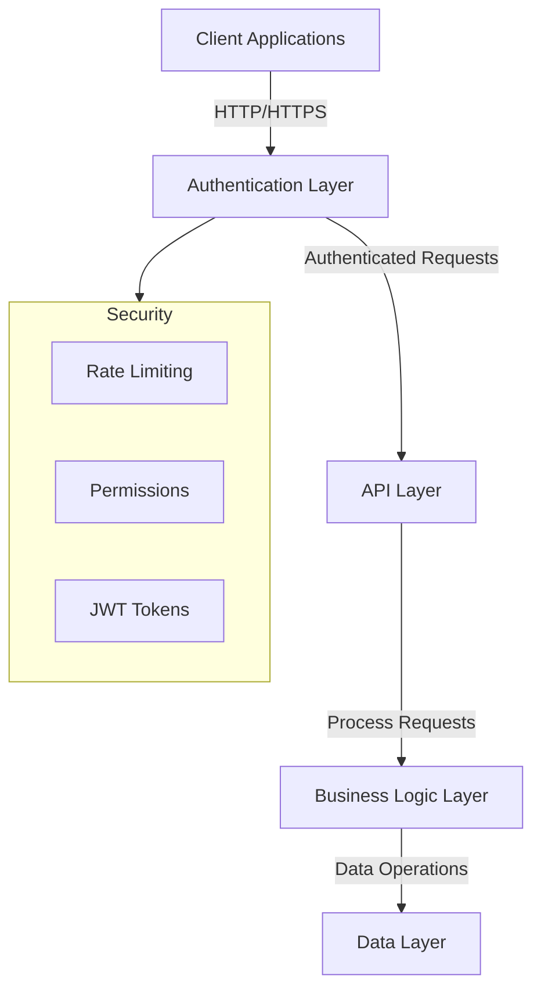

# Recipe Hub Backend

Welcome to the Recipe hub app backend documentation. This Django REST Framework application provides a robust API for managing recipes, user interactions, and authentication. The backend is designed with security, scalability, and performance in mind.

## System Architecture

The backend follows a layered architecture pattern:



## Features

### Authentication & Security
- JWT-based authentication with configurable token lifetimes
- Custom registration system with enhanced security:
  - Email uniqueness enforcement
  - Password strength requirements
  - Role-based registration control
- Rate limiting to prevent abuse:
  - Anonymous users: 60 requests/minute
  - Authenticated users: 150 requests/minute

### Recipe Management
- Complete CRUD operations for recipes
- Author-only access for modifications
- Optimized database queries using select_related and prefetch_related
- Pagination support (10 items per page)
- Comprehensive search capabilities

### Interaction Systems
- Nested comment system with full CRUD operations
- Difficulty rating system:
  - One rating per user per recipe
  - Automatic average calculation
  - Update limitations to prevent abuse
- Fine-grained permission controls

## Technical Requirements

- Python 3.10+
- MySQL 8.0+
- Virtual environment (recommended)
- Required packages listed in requirements.txt

## Installation Guide

This guide provides two approaches to setting up the Recipe Hub backend: a "Fresh Start" approach and a "Direct Clone" approach. Choose the one that works best for you.

### Option 1: Fresh Start Approach (Recommended for Beginners)

This approach creates a new Django project from scratch and then integrates our code:

1. Install Python 3.10 or higher from [python.org/downloads/](https://www.python.org/downloads/)

2. Create a new project directory and virtual environment:
   ```bash
   mkdir recipe_hub_app
   cd recipe_hub_app
   python -m venv venv
   
   # Windows
   venv\Scripts\activate
   
   # macOS/Linux
   source venv/bin/activate
   ```

3. Install Django and create a new project:
   ```bash
   pip install django
   django-admin startproject recipe_hub_backend
   cd recipe_hub_backend
   ```

4. Now clone our repository to a temporary location:
   ```bash
   git clone https://github.com/nikprov/Recipe-hub-app.git temp_repo
   ```

5. Copy or save the `SECRET_KEY='thesecretkey...'` from `recipe_hub_backend/settings.py` 
   You will need this at the later step of setting the .env file.

6. Copy our application files over your new project. Do it manually or with:
   ```bash
   cp -r temp_repo/recipe_hub_backend/* .
   rm -rf temp_repo
   ```

7. Install dependencies:
   ```bash
   pip install -r requirements.txt
   ```

### Option 2: Direct Clone Approach

This approach directly clones our repository:

1. Install Python 3.10 or higher

2. Clone the repository:
   ```bash
   git clone https://github.com/nikprov/Recipe-hub-app.git
   cd Recipe-hub-app/recipe_hub_backend
   ```

3. Create and activate virtual environment:
   ```bash
   python -m venv venv
   
   # Windows
   venv\Scripts\activate
   
   # macOS/Linux
   source venv/bin/activate
   ```

4. Install dependencies:
   ```bash
   pip install -r requirements.txt
   ```

### Common Steps for Both Approaches

1. Create your environment file:
   ```bash
   cp .env.example .env # For Windows: copy .env.example .env
   ```

2. OPTIONAL - Only for Direct Clone Approach --> Generate a new secret key:
   ```bash
   python -c "from django.core.management.utils import get_random_secret_key; print(get_random_secret_key())"
   ```

3. Update your `.env` file with the new secret key you kept aside from the settings.py (as instructed in the previous guide section).

4. Choose the database and configure it in settings or/and in .env

    There are two configurations for databases in the settings.py file. The first one commented-out is needed should you
      choose to use the default django SQLite3 database. The second and enabled configuration points
      at the .env file at the root dir and requires installing the mySQL database prior to any migrations.
      Un-comment whichever you prefere to work with, and subsequently comment-out the other.
```
# recipe_hub_backend\recipe_hub_backend\settings.py

DATABASES = {
      'default': {
           'ENGINE': 'django.db.backends.sqlite3',
          'NAME': BASE_DIR / 'db.sqlite3',
        }
    }

DATABASES = {
    'default': {
        'ENGINE': 'django.db.backends.mysql',
        'NAME': os.getenv('DB_NAME'),
        'USER': os.getenv('DB_USER'),
        'PASSWORD': os.getenv('DB_PASSWORD'),
        'HOST': os.getenv('DB_HOST'),
        'PORT': os.getenv('DB_PORT'),
    }
}

# in the:  recipe_hub_backend\.env

# Database configuration - Again comment-out whichever you don't use.

# Option 1: SQLite (simpler setup)
# DATABASE_URL=sqlite:///db.sqlite3

# Option 2: MySQL configuration (if you choose to use MySQL)
# DB_NAME=recipe_hub_db
# DB_USER=your_db_user
# DB_PASSWORD=your_db_password
# DB_HOST=localhost
# DB_PORT=3306
```

5. Initialize the database:
   ```bash
   python manage.py makemigrations
   python manage.py migrate
   ```
   In case of using mySQL or other external DB, make sure you have correct credentials for the database user and its permissions on the database in the .env file.

6. Create a superuser with name "admin":
   ```bash
   python manage.py createsuperuser
   ```
   This is needed to access the built-in admin interface of django. (at http://localhost:8000/admin - usually: http://127.0.0.1:8000/admin)

## Loading Sample Data

You have three options for loading sample data:

### Option 1: Using Django Management Command (Recommended)

The sample data script will use the fixtures JSON file containing 12 recipes posted by three users with the following test credentials:

Admin (staff member)
Username: admin,

TestUser1 (non staff users):
Usernames: testuser1, testuser2

So in order to be parsed successfuly you need to create apart from the staff "admin" user also the other two non-staff users named "testuser1" and "testuser2". Do this manually via the admin django interface (http://localhost:8000/admin). Then run the following command from the root dir (recipe_hub_backend>):
```bash
python scripts/populate_sample_data.py
```

### Option 2: Using JSON Fixture
```bash
python manage.py loaddata recipe_hub_sample_data.json
```

### Option 3: Using SQL Script (MySQL only)
```bash
mysql -u your_user -p recipe_hub_db < scripts/sample_data.sql
```

## Starting the Development Server

```bash
python manage.py runserver
```
This will show a clickable link in the console that leads to the `home.html` template with various shortcuts.
Visit http://localhost:8000/admin to verify your installation.

## Troubleshooting

### Common Issues:

1. "Django not found" error:
   - Verify virtual environment is activated
   - Reinstall requirements:
     ```bash
     pip install -r requirements.txt
     ```

2. Database errors:
   - For simplicity, start with SQLite (default)
   - Verify database settings in `.env`

3. Sample data errors:
   - Use the recommended `populate_sample_data` command
   - If using MySQL, ensure proper credentials

## Next Steps

1. Try creating a recipe through the admin interface
2. Test the API endpoints via http://localhost:8000/api/ (see list below)
 or via the Swagger UI at http://localhost:8000/api/docs/
3. Set up the frontend (see frontend README)


## API Endpoints

### Authentication
- POST `/api/auth/registration/`: Register new user
- POST `/api/auth/token/`: Obtain JWT token
- POST `/api/auth/token/refresh/`: Refresh JWT token
- GET `/api/auth/user/`: Get user details

### Recipes
- GET `/api/recipes/`: List recipes (paginated)
- POST `/api/recipes/`: Create recipe
- GET `/api/recipes/{id}/`: Get recipe details
- PUT `/api/recipes/{id}/`: Update recipe
- DELETE `/api/recipes/{id}/`: Delete recipe

### Comments
- GET `/api/recipes/{recipe_id}/comments/`: List comments
- POST `/api/recipes/{recipe_id}/comments/`: Add comment
- PUT `/api/recipes/{recipe_id}/comments/{id}/`: Update comment
- DELETE `/api/recipes/{recipe_id}/comments/{id}/`: Delete comment

### Difficulty Ratings
- GET `/api/recipes/{recipe_id}/difficulty-ratings/`: List ratings
- POST `/api/recipes/{recipe_id}/difficulty-ratings/`: Add rating
- PUT `/api/recipes/{recipe_id}/difficulty-ratings/{id}/`: Update rating
- DELETE `/api/recipes/{recipe_id}/difficulty-ratings/{id}/`: Delete rating

## API endpoint Permissions

### Authentication
- POST `/api/auth/registration/`: Unauthenticated users `OR` superusers
- POST `/api/auth/token/`: all users
- POST `/api/auth/token/refresh/`: all users
- GET `/api/auth/user/`: all users

### Recipes
- GET `/api/recipes/`: all users
- POST `/api/recipes/`: authenticated users
- GET `/api/recipes/{id}/`: authenticated users
- PUT `/api/recipes/{id}/`: authenticated users `&` authors of {id} recipe
- DELETE `/api/recipes/{id}/`: authenticated users `&` authors of {id} recipe `OR` superusers

### Comments
- GET `/api/recipes/{recipe_id}/comments/`: authenticated users
- POST `/api/recipes/{recipe_id}/comments/`: authenticated users
- PUT `/api/recipes/{recipe_id}/comments/{id}/`: authenticated users `&` authors of {id} recipe
- DELETE `/api/recipes/{recipe_id}/comments/{id}/`: authenticated users `&` authors of {id} recipe `OR` superusers

### Difficulty Ratings
- GET `/api/recipes/{recipe_id}/difficulty-ratings/`: authenticated users - GET method for this endpoint is used indirectly in the frontend to calculate the average value of all ratings for the respective recipe. Therefore, an unauthenticated user can only see the average difficulty rating value both in recipe list and recipe detail page.
- POST `/api/recipes/{recipe_id}/difficulty-ratings/`: authenticated users - Only one POST per user per recipe.
- PUT `/api/recipes/{recipe_id}/difficulty-ratings/{id}/`: authenticated users `&` authors of {id} difficulty-ratings This action has a frontend throttle limit of 5 times/recipe {id}. Displays a warning message.
- DELETE `/api/recipes/{recipe_id}/difficulty-ratings/{id}/`: authenticated users `&` authors of difficulty-ratings/{id}  `OR` superusers - Not accesible from the frontend yet.


## Rate Limiting

The API implements the following rate limits:
- Anonymous users: 60 requests per minute
- Authenticated users: 150 requests per minute

Rate limit headers in responses:
- X-RateLimit-Limit: Maximum requests allowed
- X-RateLimit-Remaining: Requests remaining
- X-RateLimit-Reset: Time until limit resets

## Testing

Run the comprehensive test suite, it covers all major functionality of the application. Key areas tested include:

### Authentication & User Management
- User registration with validation
  - Password complexity requirements
  - Email uniqueness
  - Username uniqueness
- JWT token authentication
- User information retrieval
- Admin vs regular user permissions

### Recipe Operations
- Recipe listing and pagination
- Recipe creation (authenticated users)
- Recipe updates (authors only)
- Recipe deletion (authors and admins)
- Cooking time validation
- Recipe details retrieval

### Comment System
- Comment creation on recipes
- Comment listing per recipe
- Comment updates (authors only)
- Comment deletion (authors and admins)
- Empty comment validation
- Nested comment relationships

### Difficulty Rating System
- Rating creation (authenticated users)
- One rating per user per recipe
- Rating updates
- Invalid rating value handling
- Average rating calculations
- User-specific rating retrieval

### Security & Permissions
- Unauthenticated access restrictions
- Author-only content modification
- Admin special privileges


Run the test suite with:
```bash
python manage.py test
```

## Swagger API documentation - Testing - Swagger spectacular

Access the API documentation at:

Swagger UI: http://localhost:8000/api/docs/

ReDoc: http://localhost:8000/api/redoc/

Raw Schema: http://localhost:8000/api/schema/

## Security Considerations

1. Password Security:
   - Minimum length enforcement
   - Complexity requirements
   - Hashing using Django's default PBKDF2

2. API Security:
   - JWT token expiration
   - CORS configuration
   - Rate limiting
   - Permission-based access control

3. Data Validation:
   - Input sanitization
   - Field validation
   - Relationship integrity

## Performance Optimizations

1. Database:
   - Efficient indexing
   - Optimized queries using select_related
   - Proper model relationships

2. API:
   - Pagination to handle large datasets
   - Cached authentication checks
   - Optimized serializers

## Various issues 

1. Migration Issues:
   ```bash
   # Reset migrations
   python manage.py migrate --fake recipes zero
   python manage.py migrate recipes
   ```

2. Permission Issues:
   ```bash
   # Grant necessary MySQL permissions
   GRANT ALL PRIVILEGES ON recipe_hub_db.* TO 'your_user'@'localhost';
   FLUSH PRIVILEGES;
   ```

## Contributing

1. Fork the repository
2. Create your feature branch
3. Write tests for new features
4. Submit a pull request

## License

See LICENSE at root dir
