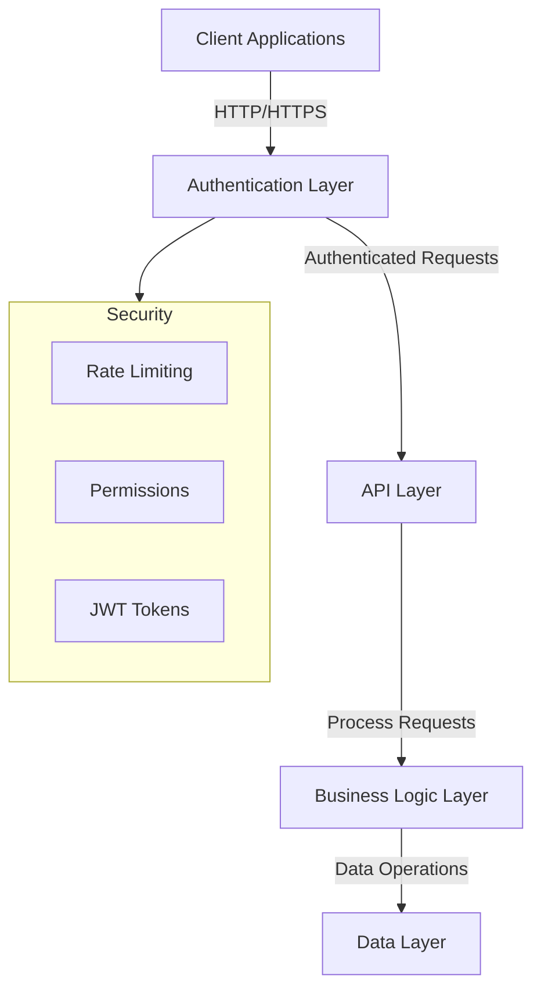
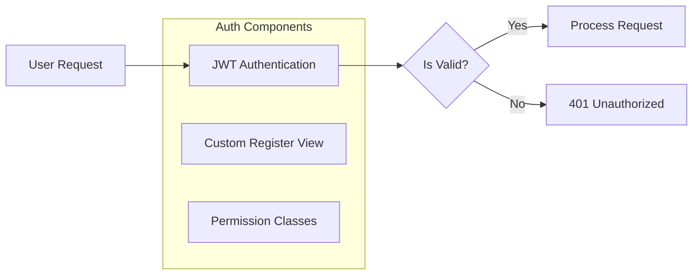
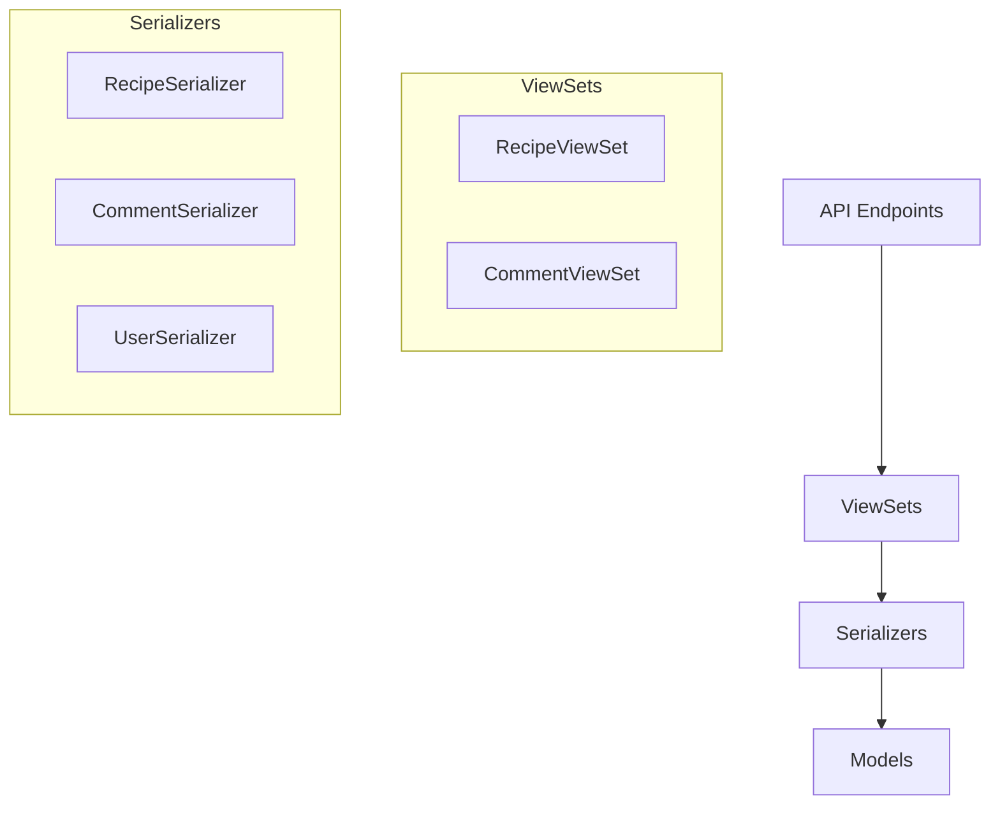
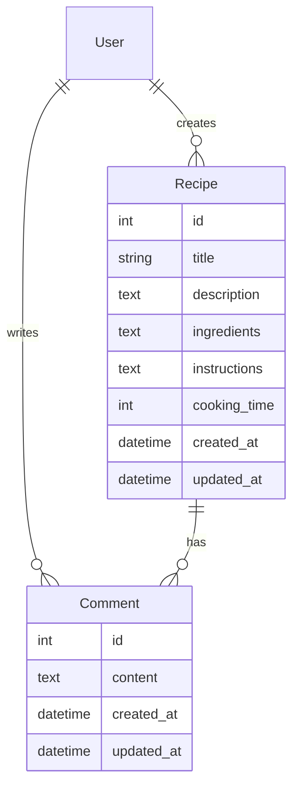
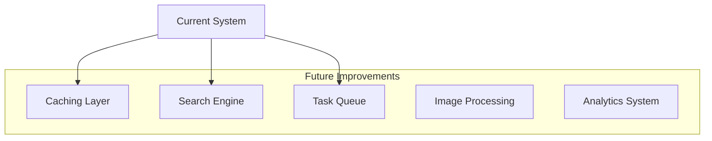

# Recipe Hub Backend Architecture Guide

This guide provides a comprehensive overview of the Recipe Hub backend architecture, explaining each component's role, the relationships between different parts of the system, and future scaling possibilities.

## System Architecture Overview

Let's start with a high-level view of our system architecture:



## Component Breakdown

### 1. Authentication Layer

The authentication system is built using Django's authentication framework with custom extensions:



Key Components:
- CustomRegisterView: Handles user registration with email uniqueness validation
- JWT Authentication: Manages access and refresh tokens
- Permission Classes: IsAuthorOrReadOnly, IsAdminUserOrReadOnly, IsNotAuthenticated

### 2. API Layer

The API layer is built using Django REST Framework with ViewSets:



### 3. Data Models

Our core data models and their relationships:



## Key Design Decisions

1. Authentication and Security
   - JWT-based authentication for stateless, scalable authentication
   - Rate limiting to prevent API abuse
   - Custom permission classes for fine-grained access control
   - Email uniqueness enforcement
   - Password strength validation

2. Database Design
   - Efficient relationship modeling using ForeignKey connections
   - Proper indexing on frequently queried fields
   - Optimized queries using select_related and prefetch_related

3. API Design
   - RESTful principles for predictable endpoint behavior
   - Nested routing for logical resource relationships
   - Comprehensive error handling and validation
   - Proper HTTP status code usage

## Scaling Considerations

1. Current Optimizations
   - Database query optimization
   - Rate limiting implementation
   - Efficient permission checking
   - Stateless authentication

2. Future Scaling Options



### Potential Future Enhancements

1. Performance Improvements:
   - Redis caching for frequently accessed recipes
   - Elasticsearch for full-text search
   - Celery for background tasks
   - CDN integration for media files

2. Feature Enhancements:
   - Recipe categories and tags
   - User favorites and ratings
   - Social sharing functionality
   - Recipe versioning
   - Meal planning system
   - Nutritional information
   - Shopping list generation

3. Technical Enhancements:
   - Docker containerization
   - CI/CD pipeline setup
   - Automated testing expansion
   - API versioning
   - GraphQL implementation option
   - Monitoring and logging system

## Development and Extension Guide

### Adding New Features

To add a new feature to the Recipe Hub backend:

1. Models Layer:
   ```python
   class NewFeature(models.Model):
       # Define model fields
       title = models.CharField(max_length=200)
       # Add relationships
       recipe = models.ForeignKey(Recipe, on_delete=models.CASCADE)
   ```

2. Serializer Layer:
   ```python
   class NewFeatureSerializer(serializers.ModelSerializer):
       class Meta:
           model = NewFeature
           fields = ['id', 'title', 'recipe']
   ```

3. ViewSet Layer:
   ```python
   class NewFeatureViewSet(viewsets.ModelViewSet):
       serializer_class = NewFeatureSerializer
       permission_classes = [permissions.IsAuthenticated]
   ```

4. URL Configuration:
   ```python
   router.register(r'new-feature', NewFeatureViewSet)
   ```

### Best Practices for Extensions

1. Security:
   - Always implement proper permissions
   - Validate user input thoroughly
   - Maintain rate limiting on new endpoints

2. Performance:
   - Optimize database queries
   - Consider caching needs
   - Monitor endpoint performance

3. Code Organization:
   - Follow existing pattern structure
   - Maintain separation of concerns
   - Document new features thoroughly

## Conclusion

The Recipe Hub backend is designed with scalability and extensibility in mind. The modular architecture allows for easy addition of new features while maintaining security and performance. Future enhancements can be integrated seamlessly into the existing structure, and the system can be scaled horizontally as needed.

Remember to always consider:
- Security implications of new features
- Performance impact of changes
- Backward compatibility
- Documentation updates
- Test coverage

This architecture provides a solid foundation for building a robust recipe sharing platform while maintaining flexibility for future growth and improvements.
